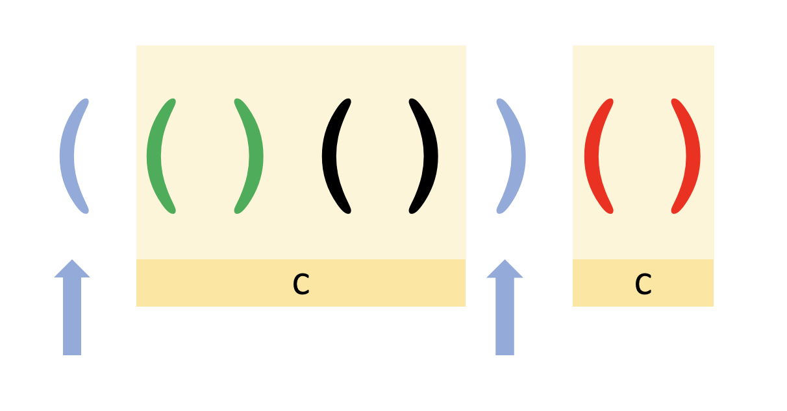

# Darboux Parser

Created for CS61A A+ Program
[Link to YouTube](https://www.youtube.com)



### Idea

> Given a BNF form, would it be faster to match the strings first, followed by the other variable quantities?

Darboux Parser is a simple BNF parser that is powered by higher order functions and recursions.
The inspiration for it comes from the above question which I was exploring. For a BNF parser, it seems to me that the strings are equivalent to *fixed points* in the partition (i.e. any string that we are parsing must match those strings at some point in time). The idea of fixing them first, then trying to match the others seem to offer a slight speed up. In some way, this also resembles the "look back" capability of regex.

To build on concepts from CS61A, I implemented the Darboux Parser as an object (uncreatively named ```DarbouxParser```) and maintained a dictionary of higher-order functions. Each of the functions are paired with a list of lists (which contains strings and other HOFs), and returns ```True``` if the input string matches any of the sequences corresponding to the lists and ```False``` otherwise. 

### Algorithms
Darboux Parser features two main algorithms:

1. ```matcher(s, st)```

This is probably the normal way which anyone would implement a matching algorithm. If the first element of ```st``` is a string, then I just check if ```s``` starts with it, and try to match the rest. Otherwise, I try all possible partitioning of ```s```.

2. ```matcher_fast(s, st)```

This is the interesting one: I try to match the first string appearing in ```st``` first. This is done with Python's regex library to enumerate all start indices of the string. Then, I try to match the previous interval and the next interval.

### Observations and Results
```matcher_fast``` shows a consistent but negligible speed up over the original ```matcher``` for the test cases.

### Limitations
Because the Darboux Parser is created to study of possible speedup by interval partitioning the string and matching the fixed points first, it lacks several BNF parser features like quantifiers (+, ?, *) etc.

### Running and Testing
```bash
$ python3 parser.py
```

Some tests have been provided. **WARNING**: running the large test cases may take ~17 seconds.
```bash
$ sh test_small.sh
$ sh test_large.sh
```

### Remarks
The name Darboux was chosen because the author was studying partitions under the topic of Darboux integral in MATH 104.
